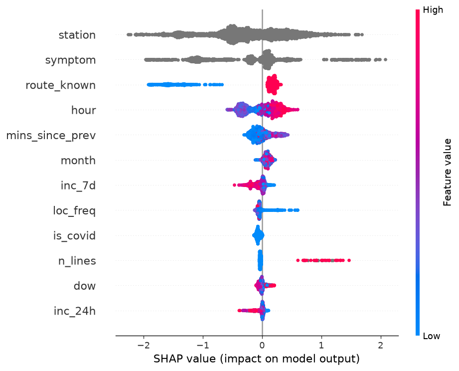
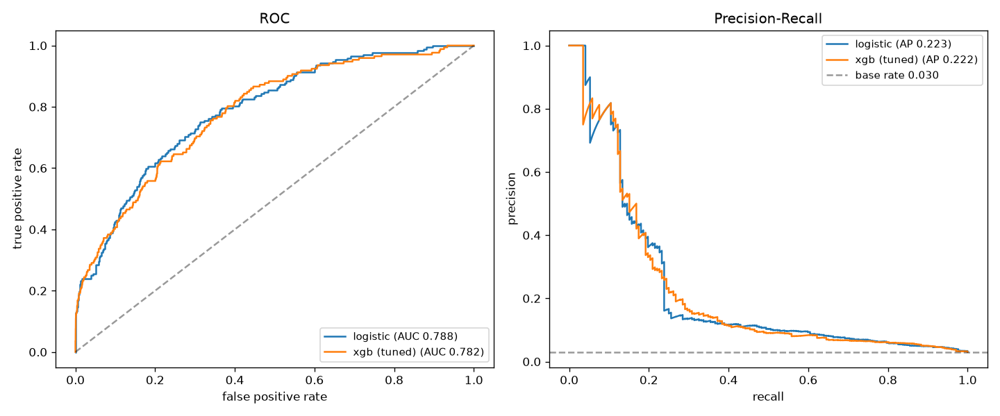
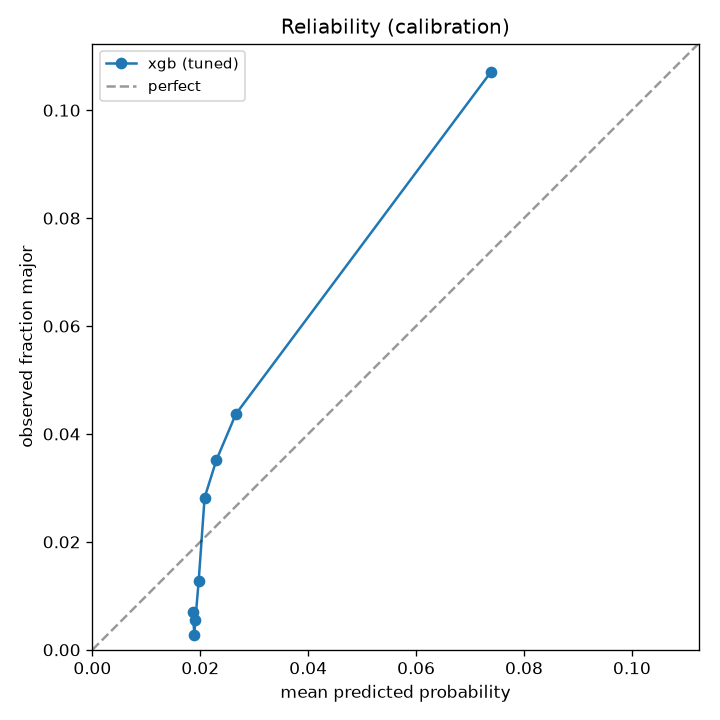

# Predictive Modeling Framework for Major Interruptions at the Société de transport de Montréal (STM) Metro

## 1. Setup

The environment is defined in [`environment.yml`](environment.yml) (Python 3.11,
conda-forge).

```bash
git clone https://github.com/saching6/DS_challenge/upload
cd DS_challenge

conda env create -f environment.yml
conda activate stm-challenge

jupyter lab
```

Launch JupyterLab from the repository root — the notebooks import from
`utils/` and `config/` using paths relative to that directory.

The notebooks are intended to be run in order:

| Order | Notebook | Purpose |
|---|---|---|
| 1 | [`stm_translator.ipynb`](stm_translator.ipynb) | French → English translation of the source data |
| 2 | [`stm_data_profiling.ipynb`](stm_data_profiling.ipynb) | Data quality, joinability, and trend profiling |
| 3 | [`stm_predictive_modeling.ipynb`](stm_predictive_modeling.ipynb) | Label construction, modeling, and evaluation |

The translated CSVs are already committed under `data/`, so steps 2 and 3 can
be run without re-running the translation.

> **Terminology.** *Planned mileage*, *planned kilometrage*, and *planned km*
> are used interchangeably throughout this document. All refer to the
> `planned_mileage` column of `data/planned_mileage_en.csv` — the kilometrage
> STM planned to operate, following reference-year budget adjustments.

## 2. Translation

Both source datasets are published in French only. Rather than translating
ad hoc, an AI-assisted translation step renders the files into English while
preserving the meaning of the source terminology — particularly in the
categorical columns, where a literal translation can silently collapse or
distort category levels that the downstream label and features depend on.

The translation maps and helper functions live in
[`utils/translation_utilities.py`](utils/translation_utilities.py).

**To run:** execute [`stm_translator.ipynb`](stm_translator.ipynb).

| | |
|---|---|
| **Input** | `data/Incidents métro_20260707.xls`<br>`data/Kilométrage métro planifé_20260707.xls` |
| **Output** | `data/metro_incidents_en.csv`<br>`data/planned_mileage_en.csv` |

## 3. Data Profiling

**To run:** execute [`stm_data_profiling.ipynb`](stm_data_profiling.ipynb).
**Full findings:** [`docs/data-profiling.md`](docs/data-profiling.md)

With the data translated, the next stage profiles both files and conducts the
exploratory analysis. Because the framework is oriented towards identifying
**major interruptions**, the profiling is deliberately targeted: it asks what
each field can and cannot support, whether the two files can be joined at all,
and which signals are available *at the moment an incident opens* rather than
after it closes.

Five findings for modeling:

1. **`incident_duration_band` is train-only in practice.** Every station
   incident is filed as `02 min and under` despite a median real duration of
   roughly 41 minutes — so the band cannot serve as a severity measure outside
   train incidents.
2. **`route` is not a join key.** The two files use the same column name for
   different things. The join is on line + day.
3. **Multi-line incidents are exploded.** They are 0.8% of rows
   but 10% of major incidents so a 13× enrichment.
4. **Major incidents are under 2% of rows**, so the modeling has to handle
   class imbalance.
5. **Planned mileage is a fair yardstick across lines and years, but a poor one
   day to day** — it explains only a few percent of within-line daily variance,
   and it records intent rather than what ran.

A sixth group of findings concerns how incidents are *recorded* rather than what
happened — missingness semantics, year-on-year completeness decline, and
temporally clustered incident numbers that cannot be told apart from cascades.
These feed the data-collection recommendations rather than the model.

## 4. Modeling

**To run:** execute [`stm_predictive_modeling.ipynb`](stm_predictive_modeling.ipynb).
Model and metric code lives in [`utils/models.py`](utils/models.py) and
[`utils/metrics.py`](utils/metrics.py); shared constants in
[`config/global_vars.py`](config/global_vars.py). Fitted models are saved to
[`saved_models/`](saved_models/) and the tuned configuration to
[`config/best_estimator_config.pkl`](config/best_estimator_config.pkl), so the
notebook can be re-run from cell 26 onward without refitting.

### Scope and label

Modeling is restricted to **train incidents**. Station incidents are excluded
because their duration data will not support the task — all of them are filed in
a single duration band, so the label carries no information there.

The label is binary and derived from `incident_duration_band`: an incident is
**major** if it runs 20 minutes or longer. The band is used in preference to the
calculated clock difference because it is STM's own assignment and therefore reflects an operational determination of severity

| Split | Window | n | Positives | Base rate |
|---|---|---|---|---|
| Train | 2019-01-01 → 2022-12-31 | 16,560 | 437 | 2.64% |
| Validation | 2023-01-01 → 2024-06-30 | 6,930 | 195 | 2.81% |
| Holdout | 2024-07-01 → 2025-09-30 | 5,677 | 172 | 3.03% |

The split is temporal, not random: incidents cluster in time and the task is to
forecast forward. Validation is further divided — through Dec 2023 for
hyperparameter tuning and threshold selection, from Jan 2024 onward for
unbiased estimation. The holdout is touched once, at the end. A sanity check
confirms no `incident_number` appears in more than one split.

Three use cases are addressed in turn: **operational**, **financial**, and
**safety**.

### 4.1 Operational use case (Escalation model)

The operational question is a decision made live: *this incident just opened —
will it run past 20 minutes, and should it be escalated now?*

**Features are restricted to what is knowable when the incident opens.** Fields
that are consequences of severity — `evacuation`, `emergency_metro`,
`material_damage`, `cat`, `kfs`, `door` — along with `primary_cause` and
`secondary_cause` (assigned after closure) and `resumption_time` (which defines
the label) are excluded from the feature set and reserved for post-hoc analysis.
They might not be useful in the first few minutes of a major incident where an escalation decision will be made.

Derived features cover time (hour of service day, day of week, month, weekend,
peak, post-midnight), location (`station` parsed out of `location_code`, plus
its frequency), incident spread (`n_lines`, `is_multi_line`), data availability
(`route_known`), and short-horizon history (rolling counts of incidents on the
same line over the prior 24 hours and 7 days, and minutes since the previous
incident on that line).

`is_covid` is included deliberately, despite being true only within the training
window. The elevated incident rate through that period is plausibly attributable
to pandemic-era staffing conditions; without a feature to absorb it, the model
would treat the elevation as permanent and carry it forward into predictions on
later data.

**Models.** Logistic regression as a baseline, then XGBoost — default, then
tuned over 100 randomised trials. A randomised search was used rather than a
grid search in the interest of time. Both are calibrated.

Validation results (Jan–Jun 2024):

| Model | PR-AUC | ROC-AUC | Brier |
|---|---|---|---|
| Logistic regression | 0.3158 | 0.7957 | 0.0268 |
| XGBoost (default) | 0.2999 | 0.7920 | 0.0292 |
| **XGBoost (tuned)** | **0.3393** | **0.8152** | **0.0253** |

PR-AUC is the primary metric: at a ~3% base rate, ROC-AUC is infalted by the
large true-negative mass. Tuning helps XGBoost greatly because logistic regression outperforms XGB with the default configuration

**Operating point.** The threshold is set by capacity rather than by an
abstract optimum: operations can realistically escalate the riskiest ~5% of
incidents, so the threshold is the 95th percentile of predicted risk on the
selection window.

**Explainability.** SHAP values are estimated on validation data,and computed on the underlying tree model (calibration is a monotone
rescaling and does not change which features drive a prediction).



Decisions are driven mainly by **where** the incident is (`station`) and **what
kind** it is (`symptom`), with time of day and multi-line spread in supporting
roles. Presumably, these are the signals an operations stakeholder would weigh, which is hopefully some evidence the model is responding to real structure rather than an artefact.

**Holdout results (July 2024 – Sept 2025):**

| Model | PR-AUC | ROC-AUC | Brier |
|---|---|---|---|
| Logistic regression | 0.2228 | 0.7885 | 0.0264 |
| XGBoost (tuned) | 0.2223 | 0.7822 | 0.0264 |

Two things to report
1. Both models lose roughly a third of their
validation PR-AUC out of period. 
2. The tuned model's validation advantage
disappears entirely — logistic regression is marginally ahead on the holdout,
and the difference between them is not meaningful either way.

At the 5%-capacity threshold the model flags **4.7%** of holdout incidents with
**18.4% precision** and **28.5% recall**, against a **3.0%** base rate — roughly
a six-fold concentration of major incidents in the flagged set. Reliability
holds directionally across bins, though the top bin remains under-confident
(predicted 7.4%, observed 10.7%).




### 4.2 Financial — expected delay burden

Calibrated probabilities become minutes, so that prioritisation can be stated in
a unit the business recognises.

Each band is mapped to its midpoint. The `30 min and over` band is the exception
— it is open-ended and, per the profiling, holds a long tail — so the clock
duration is used there, floored at 30 minutes. Typical durations are then
learned empirically from training data by symptom, at both the median and the
90th percentile:

| Symptom | n | Median minutes | p90 minutes |
|---|---|---|---|
| Customers | 187 | 38.0 | 77.0 |
| Fire, smoke, odour, substance, etc. | 94 | 39.0 | 80.0 |
| Fixed equipment | 106 | 42.0 | 137.5 |
| Rolling stock | 44 | 33.0 | 70.2 |

Expected minutes per incident blend the two states:

$$\mathbb{E}[\text{minutes}] = P(\text{major}) \times \text{incident_minutes}_{\text{if major}} + P(\text{minor}) \times \text{incident_minutes}_{\text{if minor}}$$

**Validation against planned mileage.** The only window where predicted burden
can be checked against a proper denominator is where the mileage and incident
files overlap. On that window, predicted burden per 100k planned km ranks the
four lines in **exactly the same order** as actual burden per km, under both the
median and the p90 severity estimate:

| Line | Actual per 100k km | Predicted (p50) | Predicted (p90) | Actual rank | Predicted rank |
|---|---|---|---|---|---|
| Green | 38.1 | 20.6 | 29.8 | 1 | 1 |
| Blue | 26.3 | 18.9 | 25.9 | 2 | 2 |
| Yellow | 18.1 | 16.1 | 22.4 | 3 | 3 |
| Orange | 16.1 | 11.3 | 16.2 | 4 | 4 |

**Caveats:**

1. **It is one small window.** Mileage ends September 2023, so this is the only
   period where the validation is possible at all.
2. **Magnitudes are biased low.** Green is predicted at 20.6 (median) or 29.8
   (p90) against an actual 38.1.
3. **The median understates the tail.** The severity table's p50 ignores the
   long durations that dominate realised minutes. Ranking transfers under both,
   but **levels match considerably better under p90** — which is the more
   defensible basis for a financial figure.
4. **The ranking does not fully hold out of period.** On the holdout window —
   where no mileage denominator exists, so the comparison is on raw minutes —
   predicted burden puts orange marginally ahead of green (6,827 vs 6,574
   minutes) while actual minutes put green ahead (10,956 vs 9,980). The top two
   invert. Blue is the worst-calibrated line, predicted at 47% of its realised
   minutes.

**Concentration of burden is weaker than the ranking result suggests.** On the
holdout, the top predicted decile holds 16.1% of realised delay minutes against
an even-split expectation of 10% — real lift, but non-monotone: the fifth decile
holds 15.8% and the seventh 15.6%. The model identifies a high-burden top slice;
it does not cleanly order the middle of the distribution.

The honest summary: **the framework can support prioritisation between lines
over a sustained window, and can concentrate attention on a high-burden top
slice. It cannot yet be relied on for absolute minute forecasts, and the p90
estimate should be preferred wherever a level rather than a rank is needed.**

### 4.3 Safety

Safety related severe events are defined retrospectively as incidents running 30+ minutes that
involved an evacuation or the metro emergency team. These are rare, so they are
**counted, not modelled** — reported by symptom over the training window:

| Symptom | Events | Per year |
|---|---|---|
| Customers | 99 | 24.8 |
| Fire, smoke, odour, substance, etc. | 69 | 17.2 |
| Fixed equipment | 44 | 11.0 |
| Rolling stock | 25 | 6.2 |
| Station operations | 2 | 0.5 |

A further **85 safety related severe events** occur in the holdout window.

Note the deliberate asymmetry: `evacuation` and `emergency_metro` are *barred*
as features in §4.1 but are *definitional* here for retrospective
classification of rare events

**The value of those flags, quantified.** Refitting the tuned model with the
four flag columns added raises validation PR-AUC from **0.339 to 0.667**
nearly double. This is not a usable model, because it is unknown whether those
flags are recorded when an incident opens or when it closes. But the gap is the
business case: **if these flags are timestamped at the moment they are raised,
escalation prediction improves substantially.** 


## 5. Limitations

- **No denominator on the holdout.** Planned mileage ends September 2023, so
  per-km burden can only be validated on a single overlap window. Holdout
  financial results are raw minutes and not exposure-adjusted.
- **The label is only as good as the band.** `incident_duration_band` is STM's
  operational judgement, which is its strength — but `30 min and over` is
  open-ended and absorbs everything from half an hour to several hours.
- **Station incidents are out of scope entirely**, and they are roughly a third
  of the record. Nothing here speaks to them.
- **No passenger exposure data.** Ridership is unavailable, so customer-driven
  incidents cannot be normalised at all, and rider impact cannot be estimated.
- **`is_covid` cannot be validated.** It is true only inside the training
  window, so its benefit is argued rather than measured.
- **Severity estimates rest on small samples** — as few as 44 training incidents
  for rolling stock — and the p50 systematically undershoots realised minutes.
- **One incident number is not reliably one interruption**, so counts are
  approximate wherever incidents cascade or get filed in fragments.
- **Tuning was a 100-trial randomised search at a single seed**, chosen for
  time. Neither the search nor the seed sensitivity has been explored.
- **Nothing measures whether earlier escalation actually helps.** The data
  records incidents, not responses, so the framework can be evaluated on
  prediction quality but not on operational outcome.

## 6. Where Data Collection Can Be Improved

Ranked by leverage on the questions in this document.

1. **Sub-divide the `30 min and over` band** (e.g. 30–59 / 60–119 / 120+). One
   label currently hides the tail that dominates total delay minutes. Highest
   value per unit of effort, and it requires no new timestamp discipline.
2. **Timestamp the flags.** Record *when* `evacuation`, `emergency_metro`,
   `material_damage`, and `cat` were raised, not only that they were. Adding
   them blind lifts validation PR-AUC from 0.339 to 0.667; if they are known at
   dispatch time, that gain is real rather than hypothetical.
3. **Link related incident numbers at entry.** A parent/child or cascade field
   would separate a single fragmented event from a genuine chain reaction —
   which carry opposite implications for how a live incident is escalated.
4. **Log the escalation decision itself.** Without a record of what operations
   did and when, no model here can be evaluated against the outcome it exists to
   improve.
5. **Extend planned mileage beyond September 2023**, and publish actual
   alongside planned. Planned mileage records intent and cannot see a demand
   shock.
6. **Assign duration bands and cause analysis to station incidents**, or state
   explicitly that the field does not apply to them. At present every station
   incident is filed in one band, which is indistinguishable from a real value.
7. **Hold the line on field completeness.** `route`, `vehicle`, and
   `hardware_type` degrade year on year, and the missingness tokens (`N/A`,
   `unassigned`, empty) should stay semantically distinct.

## 7. AI Disclosure

All AI-assisted work was performed with a human in the loop, and manually
verified.

- **Translation** of the source datasets, and conversion of the published data
  dictionary from PDF into JSON.
- **Language and grammatical refinement of this README**, with the author in the
  loop. All content was verified by the author prior to submission.
- **Agentic coding tools were not used** — no Claude Code, no Cursor. The
  analysis and modeling code is the author's own.
